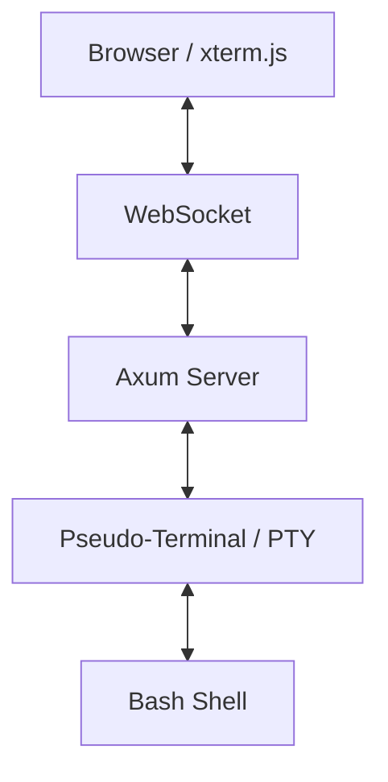

# Architecture of Axum Bash CLI

This document describes the high-level architecture of the Axum Bash CLI application, which provides a web-based terminal interface using Rust and WebSockets.

## Overview

The application follows a client-server architecture where the frontend (a web browser) communicates with a backend (Rust server) via WebSockets to provide a real-time terminal experience.

## System Components

### 1. Frontend (Client-Side)
- **Technology:** HTML/CSS/JavaScript
- **Terminal Rendering:** Uses [xterm.js](https://xtermjs.org/) to provide a full-featured terminal emulator in the browser.
- **Communication:** Establishes a WebSocket connection to the backend (`/ws`).
- **Input Handling:** Captures raw keystrokes (including control sequences for tools like `vim` or `top`) and sends them to the server.
- **Output Rendering:** Receives binary or text data from the server and renders it in the terminal.

### 2. Backend (Server-Side)
- **Technology:** [Axum](https://github.com/tokio-rs/axum) (Web Framework) on [Tokio](https://tokio.rs/) (Async Runtime).
- **Static Hosting:** Serves the frontend assets from the `static/` directory.
- **WebSocket Handler:** Manages bi-directional streaming between the browser and the server.
- **PTY Management:** Uses the [`portable-pty`](https://crates.io/crates/portable-pty) crate to create a pseudo-terminal and spawn a `bash` process.
- **Concurrency Model:** 
    - A dedicated thread for reading from the PTY to avoid blocking the async executor.
    - Tokio tasks for sending data to the WebSocket and receiving input from it.

### 3. Data Flow
1. **User Input:** The user types in the browser terminal. `xterm.js` captures the input and sends it over the WebSocket.
2. **Command Filtering:** The backend receives the input and performs a basic check against a `COMMAND_WHITELIST`.
3. **PTY Execution:** Validated input is written to the master side of the PTY, which is processed by the slave `bash` shell.
4. **Shell Output:** `bash` generates output (stdout/stderr).
5. **Real-time Feedback:** The backend reads the PTY output and streams it back to the client via WebSocket for immediate rendering.

## Security
- **Command Whitelist:** A hardcoded list of allowed commands (`ls`, `vim`, `cat`, etc.) is used to limit the scope of execution.
- **Localhost Binding:** By default, the server binds to `127.0.0.1` to prevent unauthorized external access.
- **Sandbox (Conceptual):** In a production environment, the `bash` process should ideally be jailed (e.g., using Docker or namespaces).

## Project Structure
- `src/main.rs`: Entry point, router configuration, WebSocket logic, and PTY bridging.
- `static/index.html`: Frontend application and `xterm.js` integration.
- `Cargo.toml`: Dependency management.
